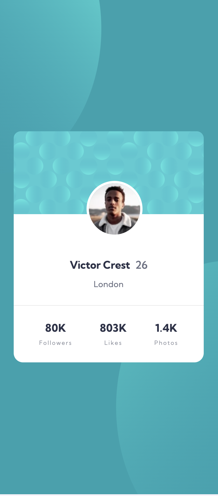
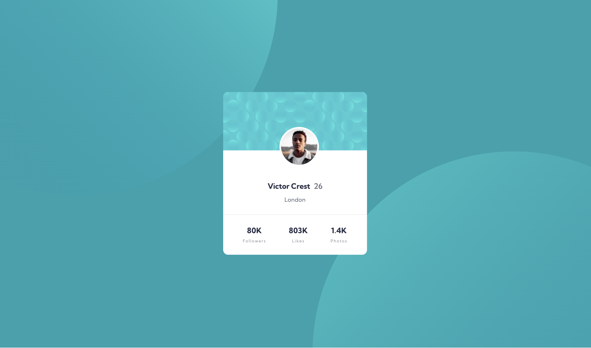

# Frontend Mentor - Profile Card Component Solution

This is a solution to the [Profile card component challenge on Frontend Mentor](https://www.frontendmentor.io/challenges/profile-card-component-cfArpWshJ). Frontend Mentor challenges help you improve your coding skills by building realistic projects.

## Table of contents

- [Overview](#overview)
  - [The challenge](#the-challenge)
  - [Screenshot](#screenshot)
  - [Links](#links)
- [My process](#my-process)
  - [Built with](#built-with)
  - [What I learned](#what-i-learned)
  - [Continued development](#continued-development)
  - [Useful resources](#useful-resources)
- [Author](#author)


## Overview

### The challenge

- Build out the profile card component and get it looking as close to the design as possible

### Screenshot




### Links

- Solution URL: [Frontend Mentor](https://your-solution-url.com)
- Live Site URL: [Github](https://your-live-site-url.com)

## My process

### Built with

- Semantic HTML5 markup
- Tailwind CSS
- Flexbox
- Mobile-first workflow
- Accessibility best practices

### What I learned

Use this section to recap some of your major learnings while working through this project:

```html
<!-- Learned about proper semantic HTML and ARIA attributes -->
<article aria-labelledby="profile-name">
  <h1 id="profile-name">Victor Crest</h1>
</article>
```

```css
/* Learned about responsive design with Tailwind */
.responsive-image {
  @apply md:h-[978px] md:w-[978px] sm:h-[700px] sm:w-[700px] h-[500px] w-[500px];
}
```

### Continued development

Areas I want to continue focusing on in future projects:
- Advanced Tailwind CSS techniques
- Accessibility best practices
- Responsive design patterns

### Useful resources

- [Tailwind CSS Documentation](https://tailwindcss.com/docs) - Comprehensive guide for Tailwind CSS
- [MDN Web Docs](https://developer.mozilla.org) - Great resource for HTML semantics and accessibility

## Author

- Website - [bkfoe](https://www.your-site.com)
- Frontend Mentor - [@bkfoe](https://www.frontendmentor.io/profile/yourusername)
